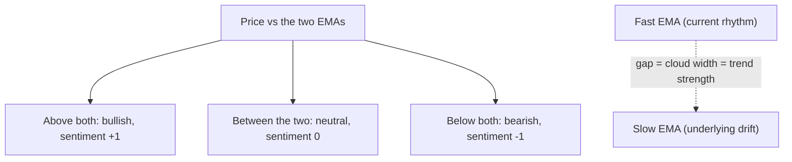
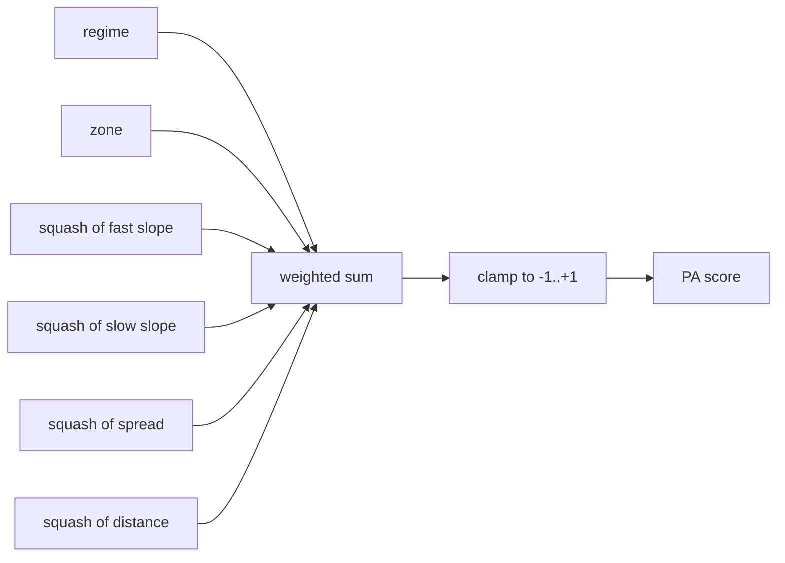
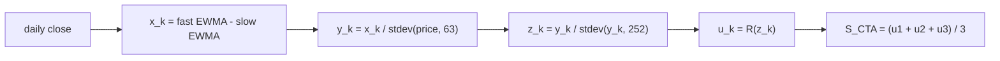

<div align = "center">

# Exponential Moving Average (EMA) Cloud

</div>

<div align = "justify">

This is the companion note to the *EMA Cloud* indicator and the `cloudTheory` library behind it. The code lives on
TradingView; this document explains the ideas the code implements. It covers three things: (I) what an EMA cloud is and
why the picture carries information, (II) how the indicator turns that picture into one bounded number - the price
action score - and (III) how the same machinery scales up to the signal construction that trend-following desks
actually run, and when each of the two scoring methods should be preferred. No source code appears here on purpose.
The note should read the same whether you opened a chart for the first time last week or spent 25 years pricing risk
at a bulge-bracket desk; the beginner path runs top to bottom, and the professional path can skim straight to the
mathematics.

---

## The Two EMA Line System

A moving average smooths price by averaging recent bars. The *simple moving average* weights every bar in the window
equally. The *exponential moving average* (EMA) weights the newest bars most, with the weight decaying geometrically
at `alpha = 2 / (L + 1)` for a length-`L` EMA. That single change makes the EMA respond faster to fresh information
at the cost of reacting to more noise. Everything in this note builds on that trade.

Plot two EMAs at once - one fast, one slow - and shade the space between them. That shaded band is the cloud.



The fast EMA tracks the current rhythm of the instrument. The slow EMA tracks its underlying drift. Their
relationship defines three states, and the indicator encodes them as a sentiment flag: `1` when price trades above
both lines (bullish), `-1` when price trades below both (bearish), and `0` when price sits between them (neutral).
Width matters as much as color. A widening cloud means the fast line is pulling away from the slow line - momentum is
building. A thin, overlapping cloud means compression: either a dying trend or a breakout loading. Markets alternate
between impulse, pullback, continuation, and exhaustion, and the cloud makes each phase visible without any extra
indicator.

Why does something this simple keep working? Institutions do not buy a position in one print. They accumulate and
distribute gradually, so genuine trend changes happen in stages, and a two-speed average pair is a natural filter for
exactly that staging. The cloud is not magic. It is a low-pass filter with a memory of two different lengths, and
that is precisely why it lags - a limitation covered honestly at the end of this note.

---

## Choosing an EMA Pair

There is no single correct pair; there is a correct pair for a holding period. The pairs below recur in published
strategies and institutional practice.

| Fast / Slow | Common Name | Typical Use |
| :---: | :---: | --- |
| 5 / 13 | Linda Raschke fast pair | Scalping and intraday momentum on 5-15 minute charts |
| 7 / 21 | NSE short swing | Multi-day momentum; popular on Indian indices and crypto |
| 9 / 21 | FX desk variation | Short-term swing on FOREX and futures |
| 20 / 50 | Swing standard | The workhorse for positional swing trading |
| 34 / 50 | Ripster Pivot Cloud | Bias filter and risk level: bullish over it, bearish under it |
| 72 / 89 | Ripster Trend Cloud | Structural trend on daily timeframes |
| 50 / 200 | Golden / Death Cross | The most watched long-horizon crossover on the planet |

Two honest footnotes. First, 34 and 89 are Fibonacci numbers, and no rigorous evidence shows Fibonacci lengths beat
neighbouring integers; their edge, where it exists, is convention and the self-fulfilling attention that follows it.
Second, the indicator ships with a short cloud of (7, 21) and a long cloud of (30, 74). The long pair is a deliberate
hybrid - roughly a blend of Ripster's pivot and trend clouds rather than either one exactly. Defensible, not sacred.
Test (34, 50) with (72, 89) against it before treating the defaults as settled.

---

## From a Picture to a Number

A cloud is easy to read and hard to backtest. To feed a systematic process, the indicator compresses the picture into
one bounded score per cloud, built from five dimensions:

  1. **Regime** - is the fast EMA above or below the slow EMA. Values `+1`, `-1`, or `0`.
  2. **Zone** - where price sits relative to the cloud, on a ladder from `+2` to `-2`.
  3. **Slope** - the one-bar rate of change of each EMA, measured in ATR units.
  4. **Spread** - the gap between the two EMAs, measured in ATR units.
  5. **Distance** - how far price has stretched from the fast EMA, measured in ATR units.

The zone ladder collapses to a small table:

| Price vs Fast EMA | Bullish Cloud (fast above slow) | Bearish Cloud (fast below slow) |
| :---: | :---: | :---: |
| Above | +2 | -1 |
| Below | +1 | -2 |

Each unbounded dimension passes through `squash()`, which is the identity `tanh(x) = 2 / (1 + exp(-2x)) - 1` written
out by hand because Pine Script v6 ships no hyperbolic functions. The bounded components then combine as a weighted
sum:

| Dimension | Weight |
| :---: | ---: |
| Regime | 0.20 |
| Zone | 0.20 |
| Fast slope | 0.20 |
| Slow slope | 0.10 |
| Spread | 0.15 |
| Distance | 0.15 |

The weights sum to exactly 1.00, so the composite lands in `[-1, +1]` by construction; a final clamp exists purely as
defence. On the chart the score prints as **PA1** for the short cloud and **PA2** for the long cloud, coloured by
simple thresholds: below `-0.25` bearish, above `+0.25` bullish, neutral between. During warmup - before the ATR and
both EMAs have enough history - the labels print `n/a` instead of a number. That is deliberate. A score fabricated
from incomplete history is worse than no score, and earlier versions of this tool learned that lesson the hard way.

One design decision deserves a paragraph, because it separates a hobby formula from a desk formula. An early draft
normalized slope as a percent change divided by ATR expressed as a percent of price. Algebra exposes the flaw:
`((f - f_prev) / f_prev * 100) / (atr / price * 100)` simplifies to `(f - f_prev) / atr * (price / f_prev)` - the
clean ATR-unit slope multiplied by a spurious `price / f_prev` factor that drifts with the level of the instrument.
The current engine measures slope, spread, and distance directly in ATR units. Same intent, no smuggled factor.



---

## Why Divide by Volatility

Every ratio above shares one denominator: a volatility estimate. This is the single most load-bearing choice in the
whole construction, and it is worth understanding why before trusting any output.

A 100-point move means nothing by itself. On an index moving 60 points a day it is a shout; on an index moving 300
points a day it is rounding error. Dividing by ATR converts every raw quantity into "how many normal days of movement
is this", which makes the score comparable across instruments, across timeframes, and across volatility regimes. A
PA1 of `0.6` on Nifty means the same intensity of trend as a PA1 of `0.6` on Bank Nifty, even though Bank Nifty moves
half again as much in points.

The academic record backs the practice with force. Moskowitz, Ooi, and Pedersen (2012) size every position in their
time-series momentum study at a constant volatility target - 40 percent annualized divided by each instrument's
trailing volatility - and the diversified result earned an annualized Sharpe ratio near 1.28 across 58 futures
markets. Kim, Tse, and Wald (2016) then ran the uncomfortable control: strip the volatility scaling out, and most of
the documented alpha evaporates, leaving something close to buy-and-hold. Read that twice. The scaling is not a
refinement of the trend signal. For risk-adjusted returns, the scaling largely *is* the signal.

---

## The Canonical CTA Signal

*CTA* stands for Commodity Trading Advisor - a US regulatory category that, in practice, means the systematic
trend-following funds (Man AHL, Winton, Aspect, and their peers) that trade every liquid futures market, commodities
or not. Their bread-and-butter trend signal was published openly by Baz, Granger, Harvey, Le Roux, and Rattray in
2015, and the library implements it faithfully under the name `bazCTA()`. The pipeline runs five stages per
timescale, across three fixed timescales:



The paper's timescale numbers hide a trap that has broken more than one public implementation. The trios S = (8, 16,
32) and L = (24, 48, 96) are not lookback lengths and not half-lives. Each `n` defines an EWMA decay
`lambda = (n - 1) / n`, equivalently a smoothing weight `alpha = 1 / n`. Pine's `ta.ema` uses `alpha = 2 / (L + 1)`
instead, so a faithful port must convert. Setting the two alphas equal gives the exact identity `L = 2n - 1`:

| Paper n (alpha = 1/n) | Half-Life (days) | Pine Length (2n - 1) |
| :---: | ---: | ---: |
| 8 | 5.2 | 15 |
| 16 | 10.7 | 31 |
| 32 | 21.8 | 63 |
| 24 | 16.3 | 47 |
| 48 | 32.9 | 95 |
| 96 | 66.2 | 191 |

The two normalizations serve different masters. Dividing by the 63-day standard deviation of *price* makes the raw
crossover comparable across instruments. Dividing by the 252-day standard deviation of the *signal itself* puts the
three timescales on equal footing, since the fast pair is intrinsically noisier and larger than the slow pair; skip
this stage and the fast scale dominates the average. The final response function is

```text
R(z) = z * exp(-z^2 / 4) / 0.89
```

with the 0.89 divisor taken verbatim from the paper (Section 3.2, equation 32). The full pipeline needs roughly 191
plus 63 plus 252 bars of history - call it 506 daily bars, about two years - before every stage matures. Until then
the signal reports `n/a`, and the indicator's optional **CTA** label respects that.

---

## z Without the Textbook

The pipeline names its normalized quantity `z`, and the letter invites a wrong assumption. A textbook z-score is
`(x - mean) / stdev`: center by the mean, scale by the standard deviation. The Baz `z` deliberately skips the
centering. It divides and never subtracts.

The omission is the point. If Nifty has trended upward for a year, the rolling mean of the crossover is itself large
and positive, and subtracting it would drag `z` toward zero exactly when the trend is strongest. A trend signal must
preserve the level and sign of the drift; only the *scale* gets standardized, so that `z = 1.4` means the same "1.4
standard deviations of trend" on any instrument in any volatility regime. In Python terms this is
`y / y.rolling(252).std()`, emphatically not `scipy.stats.zscore(y)`.

Two practical consequences follow. The distribution of `z` is roughly unit-scale but autocorrelated and fat-tailed,
so Gaussian tail intuition understates how often `|z|` exceeds 3, especially around regime breaks. And the 252-day
denominator quietly decays stale extremes: in a long persistent trend the window fills with large values, the
denominator grows, and `z` shrinks even while the trend continues. Fresh extremes are handled by the response
function instead. The two mechanisms were designed as a pair.

---

## squash() Versus bazResponse()

Both functions bound a signal, and here the similarity ends. One is monotone; the other gives money back at the
extremes. The chart below overlays them, drawn to scale.

```chart
{
  "type": "line",
  "title": "squash() vs bazResponse(), drawn to scale",
  "xKey": "z",
  "xLabel": "z (standardized trend)",
  "smooth": true,
  "series": [
    { "key": "tanh", "label": "tanh(z)" },
    { "key": "R", "label": "R(z)" }
  ],
  "refLines": [
    { "y": 0 },
    { "x": 1.41, "label": "R peaks at z = 1.41" }
  ],
  "data": [
    { "z": -4, "tanh": -0.999, "R": -0.082 },
    { "z": -3.75, "tanh": -0.999, "R": -0.125 },
    { "z": -3.5, "tanh": -0.998, "R": -0.184 },
    { "z": -3.25, "tanh": -0.997, "R": -0.26 },
    { "z": -3, "tanh": -0.995, "R": -0.355 },
    { "z": -2.75, "tanh": -0.992, "R": -0.467 },
    { "z": -2.5, "tanh": -0.987, "R": -0.589 },
    { "z": -2.25, "tanh": -0.978, "R": -0.713 },
    { "z": -2, "tanh": -0.964, "R": -0.827 },
    { "z": -1.75, "tanh": -0.941, "R": -0.914 },
    { "z": -1.5, "tanh": -0.905, "R": -0.96 },
    { "z": -1.25, "tanh": -0.848, "R": -0.95 },
    { "z": -1, "tanh": -0.762, "R": -0.875 },
    { "z": -0.75, "tanh": -0.635, "R": -0.732 },
    { "z": -0.5, "tanh": -0.462, "R": -0.528 },
    { "z": -0.25, "tanh": -0.245, "R": -0.277 },
    { "z": 0, "tanh": 0, "R": 0 },
    { "z": 0.25, "tanh": 0.245, "R": 0.277 },
    { "z": 0.5, "tanh": 0.462, "R": 0.528 },
    { "z": 0.75, "tanh": 0.635, "R": 0.732 },
    { "z": 1, "tanh": 0.762, "R": 0.875 },
    { "z": 1.25, "tanh": 0.848, "R": 0.95 },
    { "z": 1.5, "tanh": 0.905, "R": 0.96 },
    { "z": 1.75, "tanh": 0.941, "R": 0.914 },
    { "z": 2, "tanh": 0.964, "R": 0.827 },
    { "z": 2.25, "tanh": 0.978, "R": 0.713 },
    { "z": 2.5, "tanh": 0.987, "R": 0.589 },
    { "z": 2.75, "tanh": 0.992, "R": 0.467 },
    { "z": 3, "tanh": 0.995, "R": 0.355 },
    { "z": 3.25, "tanh": 0.997, "R": 0.26 },
    { "z": 3.5, "tanh": 0.998, "R": 0.184 },
    { "z": 3.75, "tanh": 0.999, "R": 0.125 },
    { "z": 4, "tanh": 0.999, "R": 0.082 }
  ]
}
```

| z | tanh(z) | R(z) | Reading |
| ---: | ---: | ---: | --- |
| 0.50 | 0.462 | 0.528 | agreement - weak trend |
| 1.00 | 0.762 | 0.875 | agreement - solid trend |
| 1.41 | 0.888 | 0.964 | the last point of agreement; R peaks here |
| 2.00 | 0.964 | 0.827 | divergence begins - tanh holds, R trims |
| 3.00 | 0.995 | 0.355 | opposite instructions |

Inside roughly 1.4 standard deviations - where the signal lives about 85 percent of the time - the two functions are
practically interchangeable. The entire argument is about the tail, and there the disagreement is not cosmetic. At
`z = 3`, tanh says maximum position while `R` says cut to a third.

The cleanest way to frame the choice: **squash measures a state, bazResponse prescribes an exposure.** A state score
must be monotone in evidence - a 3-ATR breakout day genuinely is a more bullish structure than a 1.4-ATR day, and a
state score that said otherwise would be lying about the chart. A position function may be non-monotone in evidence,
because expected *forward* return is not monotone in trend extremity: trends stretched past 1.4 sigma carry rising
crowding, profit-taking, and snap-back risk, and the worst historical losses of momentum strategies arrive
immediately after extreme moves. `R(z)` bakes that fade directly into the sizing. tanh rides the whole move and eats
the whole reversal. Neither is wrong; they answer different questions.

The hump also creates a genuine reading ambiguity worth internalizing. `R` maps two inputs to every mid-range output.
A per-scale reading of `-0.41` corresponds either to `z` near `-0.38` (a mild downtrend still building toward the
peak) or to `z` near `-2.87` (a badly stretched downtrend that the function is deliberately fading) - and those two
worlds call for opposite behaviour at entry. A blended `S_CTA` of `-0.41` admits a third story: scale disagreement,
for example `u1 = +0.20` with `u2 = -0.60` and `u3 = -0.83`, a structural downtrend whose fast leg has already turned.
This is exactly why the library returns the three per-scale values alongside the average. Check whether the
components agree before acting on the blend.

The verdict, then, is conditional and firm. Prefer `bazResponse()` for anything you will size a position from,
because there its input is a properly double-normalized `z` and the peak at `sqrt(2)` means something. Keep
`squash()` for the five-dimension composite and for any threshold or label logic, because there the inputs are
un-standardized ATR-unit quantities and monotone ordering is the property you need. Swapping the response function
into the composite without also adding the normalization pipeline would relocate the hump to an arbitrary spot - a
bug wearing the costume of an upgrade.

---

## Reading the Numbers on the Chart

The indicator prints up to three labels on the last bar.

  * **PA1** - the composite score of the short cloud, in `[-1, +1]`.
  * **PA2** - the composite score of the long cloud, same range.
  * **CTA** - the optional canonical three-scale signal, bounded in about `[-0.96, +0.96]` because the response
    function peaks at `0.9638` when `z = sqrt(2)` and decays beyond it. It can never print exactly `1`.

Read every value as an exposure dial, not a grade. A CTA of `-0.41` is a net short stance at roughly 43 percent of
maximum conviction - the desks running this construction would hold about that fraction of their per-instrument risk
budget short, before the volatility-targeting layer converts conviction into contract counts. Sensible daily-chart
buckets: below `0.2` in absolute value is no-man's land, stand aside; `0.2` to `0.5` is a moderate trend worth
partial size; beyond `0.5` demands all three timescales aligned and is where trend followers carry full risk. And a
timing note that costs nothing to respect: values fluctuate while a bar is still forming, so act on confirmed bars.
The `n/a` you see on a young chart is the warmup gate doing its job.

---

## What the Script Offers

The `cloudTheory` library (version 5) exposes four capabilities, described here by behaviour rather than by code.

  1. **Cloud construction** - computes the fast and slow EMAs for any pair, the three-state sentiment flag, and the
     two crossover events, ready for shading and for alerts.
  2. **Price action scoring from precomputed EMAs** - the five-dimension composite with every weight exposed as a
     parameter (defaults as tabled above), ATR-unit normalization throughout, strict propagation of missing values,
     and a validity flag so a consumer can distinguish "no signal yet" from "signal of zero". Accepting precomputed
     EMAs means the indicator calculates each pair exactly once instead of twice.
  3. **A self-contained scoring wrapper** - the same engine addressed by EMA lengths, kept for compatibility with
     earlier consumers of the library.
  4. **The canonical CTA signal** - the full Baz construction with the exact `2n - 1` length conversion, the 63-day
     and 252-day windows, the published response function, and the per-scale components returned alongside the
     average.

The consuming indicator draws both clouds with sentiment coloring, marks long-cloud crossovers by default (short-cloud
crossovers are off by default because they are noisy), rejects impossible configurations such as a fast length at or
above the slow length, and prints the labels described in the previous section. The library is published on
TradingView under [ZenithClown](https://in.tradingview.com/u/ZenithClown/), with project notes at
[growthio/tradingview](https://github.com/growthio/tradingview).

---

## Validating Before Trading

A score that looks right on the last bar has proven nothing. The ladder below is the order in which evidence should
be gathered, with thresholds stated so that failure is recognizable.

  1. Compute the *rank information coefficient* - the Spearman correlation between the signal today and the forward
     return over one, three, five, and ten days. A stable rank IC between `0.02` and `0.07` out of sample is real; a
     rank IC above `0.10` is a red flag for look-ahead or overfitting, not a triumph.
  2. Track ICIR, the mean IC divided by its standard deviation. Above `0.5` is healthy.
  3. A/B the signals: composite versus per-pair response versus canonical CTA, on rank IC alone. If a challenger
     underperforms the incumbent out of sample, revert. Sentiment about elegance does not vote.
  4. A/B the cloud lengths: (34, 50) with (72, 89), and (20, 50) with (50, 100), against the shipped (7, 21) with
     (30, 74). Change defaults only on a margin that exceeds noise.
  5. Size positions by volatility target divided by realized volatility, scaled by the signed signal. This is where
     the risk-adjusted return is actually won, per the Kim, Tse, and Wald decomposition.
  6. Backtest with the signal at close trading the next open, full Indian cost stack included - brokerage, STT, and
     impact. No look-ahead anywhere.
  7. Gate an experiment on regime: halve or flatten size when ADX(14) sits below 25, and loosen the gate if
     out-of-sample Sortino drops.
  8. Ship at an out-of-sample Sortino above `1`, and compute the Deflated Sharpe Ratio to account for every parameter
     you searched along the way. A strategy must also beat the index it trades: Nifty's long-run total-return CAGR
     sits near 12.4 percent, and that is the bar after costs, not before.

---

## Limitations

  * Every moving average lags. The cloud confirms trends; it does not predict them.
  * Thin, overlapping clouds whipsaw. The composite score mutes but does not eliminate chop.
  * The canonical CTA signal needs about two years of daily history before it says anything. On a young listing it
    will honestly say `n/a` for a long time.
  * Live-bar values fluctuate until the bar closes. Automated consumers should act on confirmed bars only.
  * Parameter choices matter and invite overfitting. The validation ladder above is the antidote, not more tuning.
  * The `z` in the pipeline is fat-tailed and autocorrelated; Gaussian tail probabilities understate extreme readings.

---

## References

  * Baz, J., Granger, N., Harvey, C. R., Le Roux, N., and Rattray, S. (2015). *Dissecting Investment Strategies in
    the Cross Section and Time Series*. [SSRN 2695101](https://papers.ssrn.com/sol3/papers.cfm?abstract_id=2695101).
    The signal construction lives in Section 3.2, equations 28-33.
  * Moskowitz, T., Ooi, Y. H., and Pedersen, L. H. (2012). *Time Series Momentum*. Journal of Financial Economics.
    [ScienceDirect](https://www.sciencedirect.com/science/article/pii/S0304405X11002613).
  * Kim, A. Y., Tse, Y., and Wald, J. K. (2016). *Time Series Momentum and Volatility Scaling*. Journal of Financial
    Markets, 30, 103-124.
  * Spiroglou, A. (2022). *MACD-V: Volatility Normalised Momentum*.
    [SSRN 4099617](https://papers.ssrn.com/sol3/papers.cfm?abstract_id=4099617).
  * Ripster EMA Clouds, the popular cloud implementation this tool's pair taxonomy references.
    [TradingView script](https://www.tradingview.com/script/7LPOiiMN-Ripster-EMA-Clouds/).
  * A minimal open-source Python implementation of the Baz signal, useful for cross-validating outputs:
    [micro_cta](https://github.com/giuliocats/micro_cta).

> **Disclaimer:** This document is for educational purposes only and should not be considered financial or investment
> advice. Trading and investing involve substantial risk, including the possible loss of capital. Always conduct
> independent research, test strategies through backtesting or paper trading, and consider consulting a licensed
> financial professional before making investment decisions.

</div>
